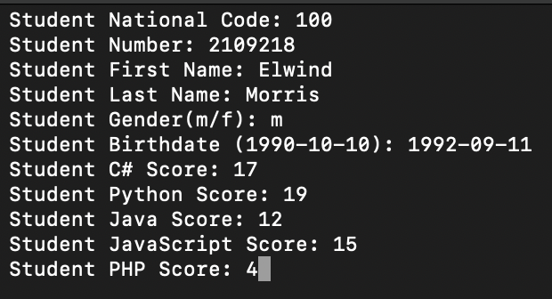
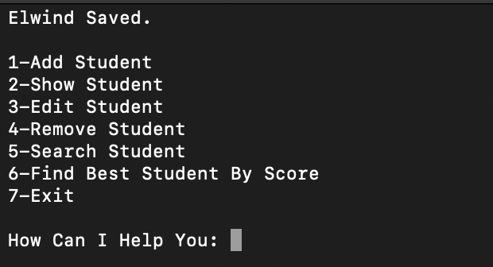
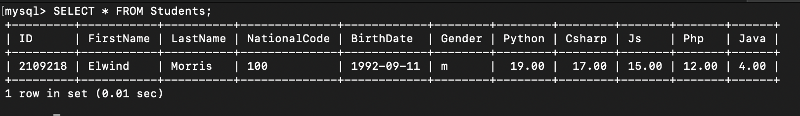

## Student Manager

A CLI Program to Manage Students, Such as ID, National Code, First Name, Last Name, Python Score ...
Each Records will save in MySQL.

### Features:
- CRUD Operations
- Create Student
- Read Student
- Update Student
- Delete Student

- Find Best Student based on scores
- Find Students Based on First Name, Last Name, Gender ...

#### Adding Student

#### Student Saved

#### MySQL Update

